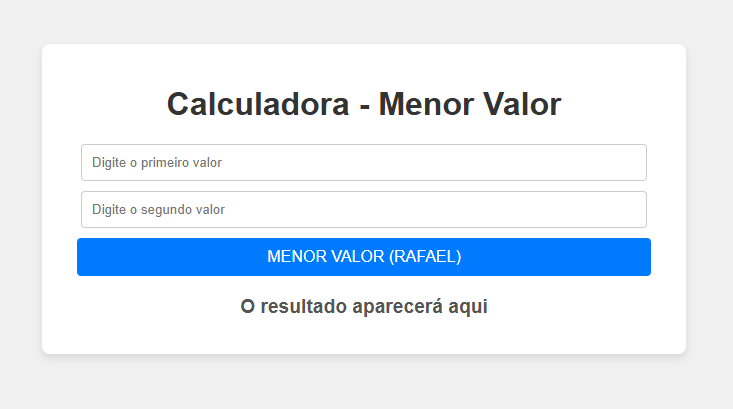

# Calculadora de Menor Valor

## Descrição do Projeto

Este projeto é uma aplicação simples desenvolvida para **determinar o menor valor entre dois números** fornecidos pelo usuário. A ideia central é criar uma interface intuitiva onde o usuário possa inserir dois números e, ao clicar em um botão, obter como resultado o menor número entre os dois.

A ferramenta é útil para fins educacionais, como exemplo de manipulação de dados numéricos em JavaScript e como construir uma interface interativa com HTML e CSS.

## Funcionalidade

- **Entrada de dados**: O usuário insere dois números em campos de entrada.
- **Cálculo**: Ao clicar no botão, a aplicação calcula qual dos dois números é o menor.
- **Exibição do resultado**: O resultado é mostrado diretamente na tela, logo abaixo do botão de ação.

## Como Funciona

1. **Recepção dos dados**: O usuário insere dois valores nos campos de entrada.
2. **Validação dos dados**: O sistema verifica se os valores inseridos são números válidos.
3. **Cálculo do menor valor**: A função utiliza a função `Math.min()` do JavaScript para calcular o menor número entre os dois valores inseridos.
4. **Resultado**: O menor valor é então exibido na página, proporcionando um feedback imediato ao usuário.

## Objetivo do Projeto

O principal objetivo desse projeto é demonstrar como realizar cálculos simples em JavaScript, como manipulação de entradas de usuários e exibição de resultados. Além disso, a aplicação foi criada para proporcionar uma interface amigável e simples, com foco na experiência do usuário.

